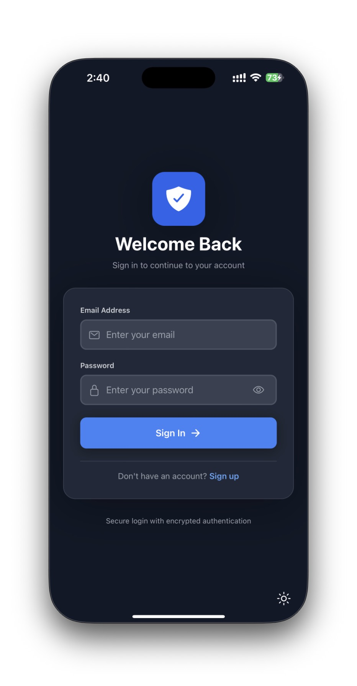
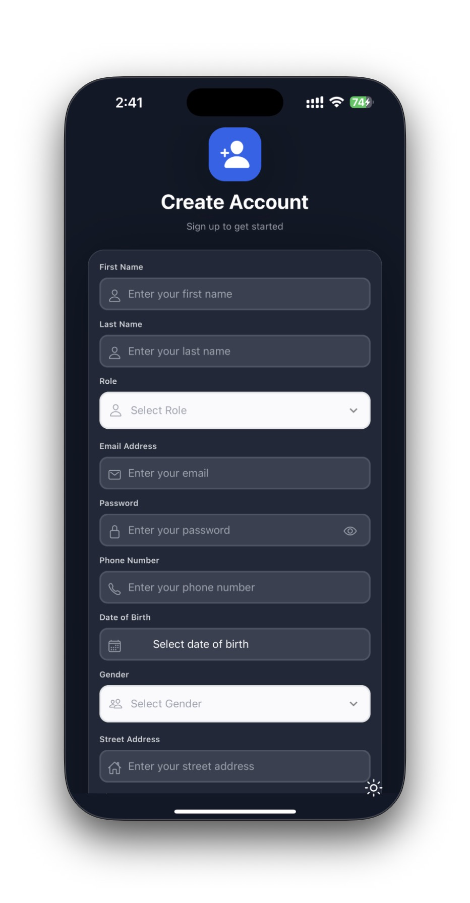
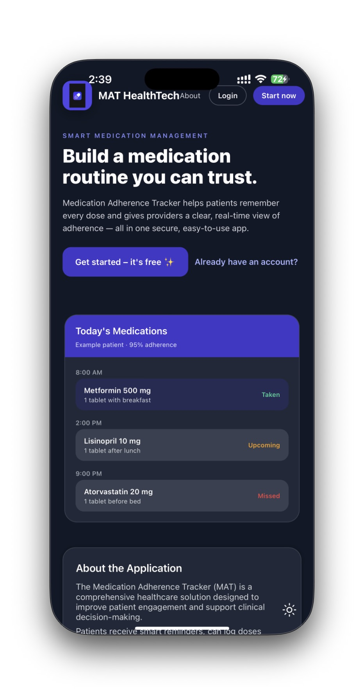
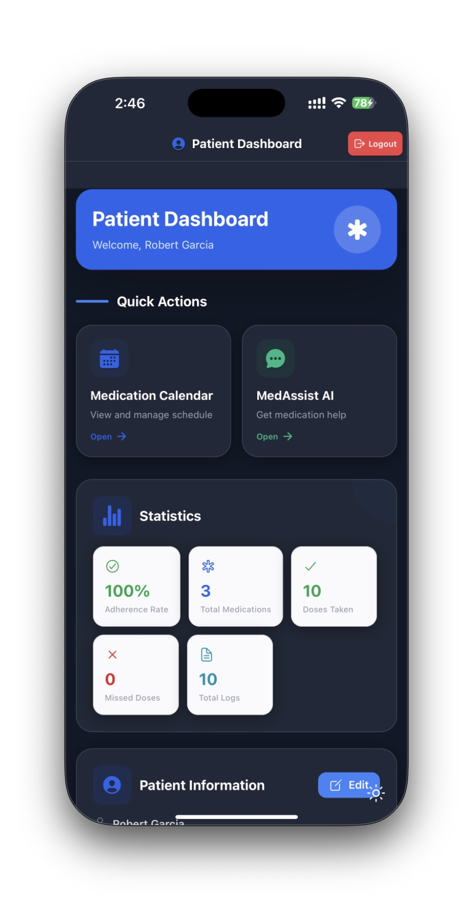
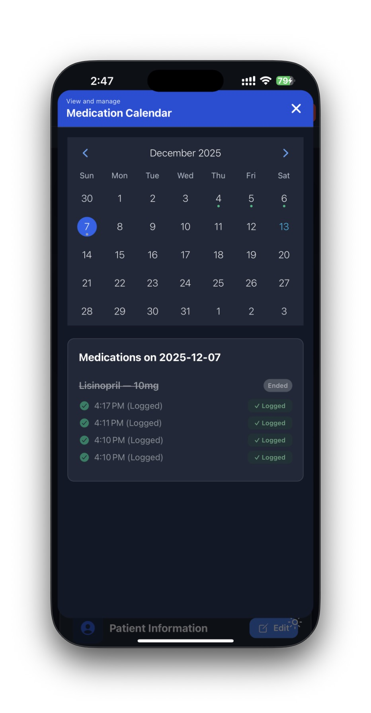
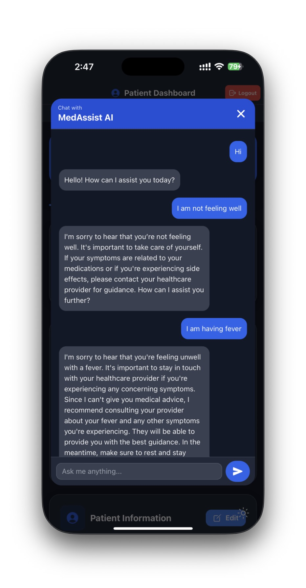
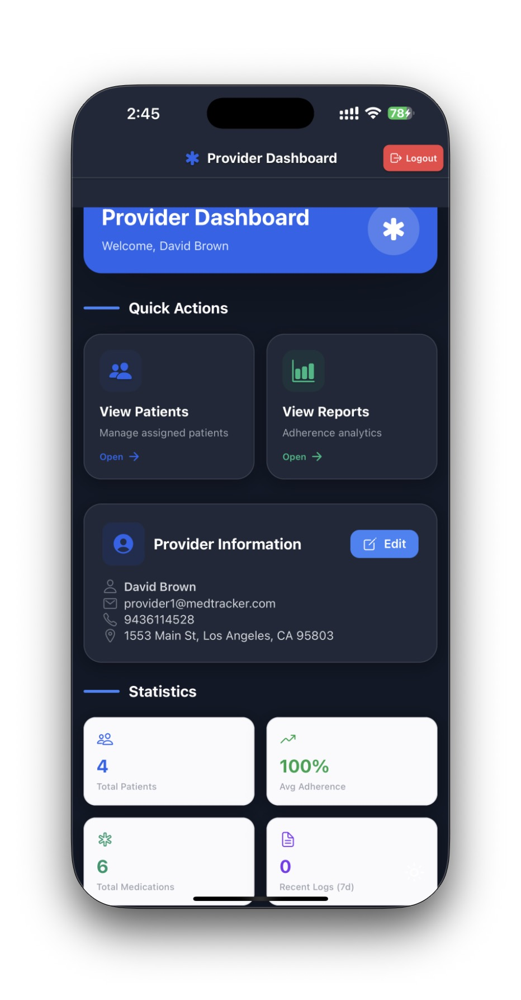
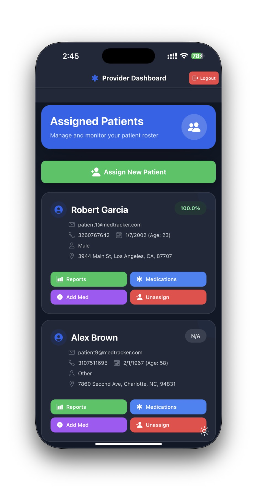
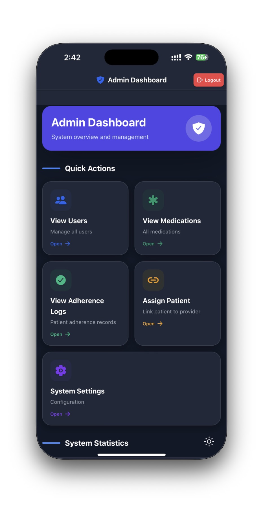

# 💊 Medication Adherence Tracker (MAT)

**Medication Adherence Tracker (MAT)** is a full-stack, cross-platform healthcare application designed to help patients manage their medications, track adherence, and receive timely reminders.  
The system also enables **providers** and **administrators** to monitor adherence trends and manage patient care efficiently.

This project was developed as the **final course project for CS 555 – Agile Methods for Software Development**.

---

## 📌 YouTube Video Demo:
Link:[https://youtu.be/MbRiTFZXNvg](https://www.youtube.com/watch?v=MbRiTFZXNvg)

## 📌 Project Overview

Medication non-adherence is a major challenge in healthcare. MAT addresses this problem by providing:

- Structured medication scheduling
- Automated reminders
- Adherence logging and analytics
- Secure, role-based access for patients, providers, and admins

The application is built using a **React Native (Expo)** frontend and a **Node.js + Express + MongoDB** backend.

---

## 🚀 Key Features

- 🔐 **Secure Authentication**
  - JWT-based authentication
  - Role-based access (Patient, Provider, Admin)

- 💊 **Medication Management**
  - Add, edit, delete medications
  - Dosage, frequency, and schedule support

- ⏰ **Smart Reminders**
  - Scheduled reminders for medication intake
  - Local and push notification support (Expo)

- 📈 **Adherence Tracking**
  - Logs taken and missed doses
  - Enables adherence trend analysis

- 👨‍⚕️ **Provider Dashboard**
  - View assigned patients
  - Monitor adherence reports

- 🛠️ **Admin Controls**
  - User and role management
  - System-level monitoring

- ☁️ **Secure Cloud Storage**
  - MongoDB for persistent data storage

- 🤖 **AI Chatbot**
  - Integrated using OpenAI API
  - Requires a valid OpenAI API key

---

## 🧠 System Architecture
```bash
Frontend (React Native / Flutter)
│
▼
Express.js API
│
▼
MongoDB Services
├── MongoDB (DB)
├── Authentication
└── Cloud Storage
```


## 🛠️ Technologies Used
| Category | Tools & Technologies |
|-----------|----------------------|
| **Frontend** | React Native, Expo, TypeScript |
| **Backend** | Node.js, Express.js |
| **Database & Cloud** | MongoDB |
| **AI Integration** | OpenAI API |
| **Notifications** | Expo Notifications |
| **Authentication** | JWT |
| **Version Control** | GitHub (Team Repository) |
| **Project Management** | Jira / Excel (User Stories, Burndown, Velocity) |
| **Communication** | Slack (Team & Instructor Updates) |
| **CI/CD** | Github Actions |


## ⚙️ How It Works
1. 🧾 **User Registration & Login:** Users authenticate securely.  
2. 💊 **Medication Entry:** Users input medicine name, dosage, and schedule.  
3. ⏰ **Reminders Triggered:** System sends alerts at the scheduled times.  
4. 📊 **Adherence Monitoring:** Tracks intake behavior and displays completion stats.  
5. ☁️ **Data Stored in Firestore:** Ensures secure, real-time cloud storage for all records.


## 🧩 Folder Structure
```bash
Medication-Adherence-Tracker/
│
├── .github/
│   └── workflows/
│       └── ci.yml                # GitHub Actions CI pipeline
│
├── backend/
│   ├── config/                   # Database & app configuration
│   ├── controllers/              # Route controllers (business logic)
│   ├── middleware/               # Auth & request middleware
│   ├── models/                   # Mongoose schemas
│   ├── routes/                   # Express API routes
│   ├── tests/                    # Backend unit & integration tests
│   ├── utils/                    # Helper utilities
│   ├── node_modules/
│   ├── .env                      # Environment variables (ignored in Git)
│   ├── package.json
│   ├── package-lock.json
│   ├── reminderScheduler.js      # Medication reminder scheduler
│   ├── seed.js                   # Database seeding script
│   └── server.js                 # Backend entry point
│
├── frontend/
│   ├── app/
│   │   ├── (admin)/              # Admin screens & routes
│   │   ├── (patient)/            # Patient screens & flows
│   │   ├── (provider)/           # Provider screens & dashboards
│   │   ├── __tests__/             # Frontend tests
│   │   ├── utils/                # Frontend helpers
│   │   ├── _layout.tsx            # Root layout (Expo Router)
│   │   ├── index.tsx              # App entry screen
│   │   ├── home.tsx
│   │   ├── login.tsx
│   │   ├── Register.tsx
│   │   ├── about.tsx
│   │   ├── modal.tsx
│   │   └── +not-found.tsx
│   │
│   ├── assets/
│   │   ├── fonts/
│   │   └── images/               # App icons & branding
│   │
│   ├── components/               # Reusable UI components
│   ├── constants/                # App-wide constants
│   ├── utils/                    # Shared utilities
│   ├── node_modules/
│   ├── app.config.js
│   ├── babel.config.js
│   ├── eas.json
│   ├── metro.config.js
│   ├── tailwind.config.js
│   ├── tsconfig.json
│   ├── jest.config.js
│   ├── global.css
│   ├── package.json
│   ├── package-lock.json
│   └── README.md
│
├── .gitignore
├── README.md                     # Project documentation
└── yarn.lock
```


## 💡 API Overview
| Endpoint | Method | Description |
|-----------|--------|-------------|
| `/api/user/register` | POST | Register a new user |
| `/api/user/login` | POST | Authenticate and login user |
| `/api/medication/add` | POST | Add new medication entry |
| `/api/medication/get/:uid` | GET | Fetch all medications for user |
| `/api/medication/update/:id` | PUT | Update existing medication record |
| `/api/medication/delete/:id` | DELETE | Remove a medication entry |


## 📊 Sprint 1 Deliverables
✅ Firebase backend setup and integration  
✅ RESTful APIs for users and medications  
✅ Successful connection between backend and Firebase  
✅ GitHub commits from all team members  
✅ Jira updates with user stories and burndown chart  
✅ Slack communication logs with demo link  

## 📊 Sprint 2 Deliverables
✅ Migrated backend to MongoDB  

✅ Implemented automated reminder scheduler (node-cron)

✅ Integrated frontend notification system (Expo Notifications) 

✅ Role-based access for admin & provider

✅ Continuous integration with GitHub actions and manual testing

✅ Slack communication logs with demo link  


## 📊 Sprint 3 Deliverables
✅ Provider reports and adherence trend analytics implemented

✅ Patient dose logging completed and integrated with backend

✅ iOS prototype demonstrated with updated patient and provider flows

✅ All backend tests passed (controllers and models)

✅ GitHub Actions CI runs verified

✅ Jira board, burnup chart, and velocity report updated 


## 🧮 Installation & Setup
### 🔧 Prerequisites
- Node.js v16+   
- `.env` file with configuration:
  ```bash
  PORT=3000
  MONGODB_URI=your_mongodb_connection_string
  JWT_SECRET=your_jwt_secret
  OPENAI_API_KEY=your_openai_api_key

  ```

### 🧱 Setup Steps
```bash
# Clone the repository
git clone https://github.com/ParthGadekar0631/Medication-Adherence-Tracker.git
```
```bash
# Navigate to backend
cd backend
```

```bash
# Install dependencies
npm install
```

```bash
# Run the server
npm start
```
## 📱 Frontend Setup
```bash
cd frontend
npm install
npx expo start -c
```


## 🖼️ Application Screenshots

### 🔐 Authentication

<p align="center">
  
  
</p>

---

### 🏠 General

<p align="center">
  
</p>

---

### 🧍 Patient Views

<p align="center">
  
  
</p>

<p align="center">
  
  
</p>

---

### 👨‍⚕️ Provider Views

<p align="center">
  
  
</p>

---

### 🛠️ Admin Views

<p align="center">
  
  
</p>

<p align="center">
  
</p>


## 🎯 Future Enhancements

- 🤖 Voice-Assistant Integration (Siri / Google Assistant)   
- 🩺 Wearable device integration  
- 📊 AI-based Adherence Analytics   


## 🤝 Team 5 — Contributors

| Name | Role | Responsibility |
|------|------|----------------|
| **Parth Gadekar** | Backend Developer | Firebase Integration, API Development |
| **Vaibhav Ganeriwala** | Database Engineer | Data Schema & Firestore Design |
| **Daniel Storms** | Frontend Developer | UI/UX and Mobile App |
| **Jared Simonetti** | Scrum Master | Jira, Sprint Management, Review |


## 🧭 Agile Workflow Tools

- **Jira:** Sprint planning, story tracking, burndown chart  
- **Slack:** Daily team communication, sprint demos  
- **GitHub:** Version control, CI/CD integration  
- **Confluence / Docs:** Sprint reviews and retrospectives  

## 📄 License

This project is released under the **MIT License** — free to use, modify, and distribute. 
